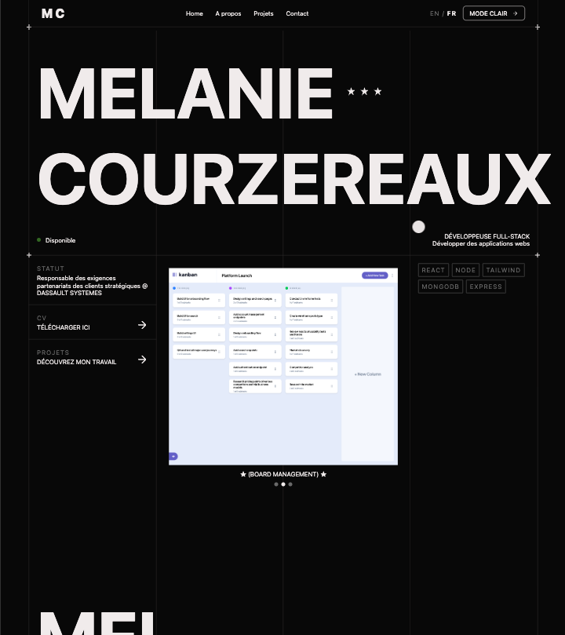
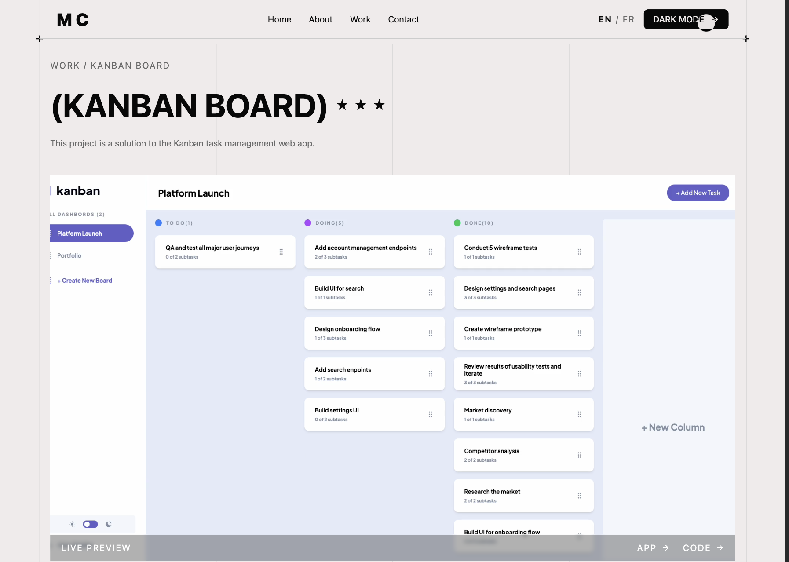
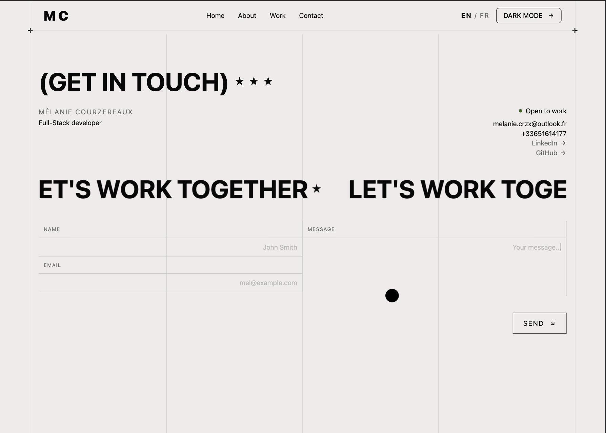
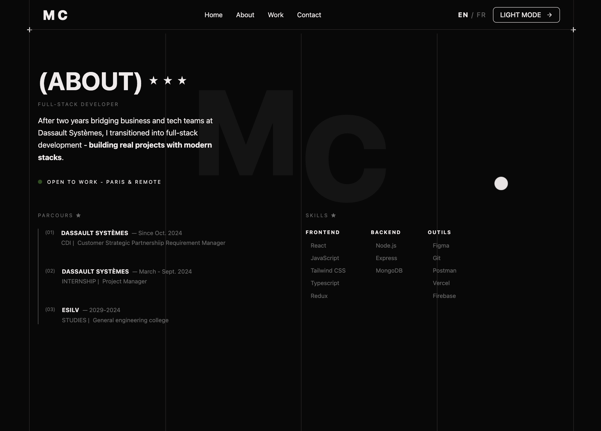
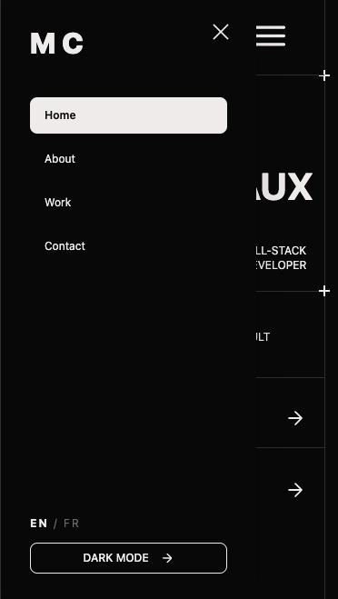
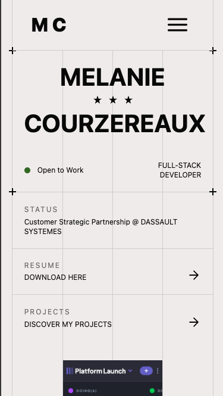

# Portfolio — Melanie Courzereaux

A fully responsive personal portfolio built from scratch, designed and developed
to reflect my identity as a developer.

## Table of contents

- [Overview](#overview)
- [Demo & Screenshots](#-demo--screenshots)
- [Tech Stack](#-tech-stack)
- [Features](#-features)
- [Links](#-links)
- [What I Learned](#-what-i-learned)
- [Author](#-author)

## Overview

Designed in Figma and developed from scratch — this portfolio reflects my journey
from engineering to full-stack development. Built with React and Tailwind CSS,
it supports bilingual content (FR/EN) and adaptive light/dark theming.

## 🎬 Demo & Screenshots

### 💻 Desktop Views

  
  

  
  

### 📱 Mobile Version

  
  

## 🛠️ Tech Stack

- **Frontend:** React + Tailwind CSS
- **Design:** Figma
- **Deploy:** Vercel

## ✨ Features

- 🌐 **Bilingual** — Full English and French support
- 🎨 **Dark/Light Mode** — Adaptive theme switching
- 📱 **Fully Responsive** — Optimized for all screen sizes
- 🖼️ **Project Showcase** — Detailed project pages with screenshots and demos
- 📬 **Contact Page** — Direct contact form

## 🔗 Links

- 🌐 **Live Demo:** [View Portfolio](https://portfolio-melaniecrzx.vercel.app/)
- 💻 **Source Code:** [GitHub Repository](https://github.com/Melaniecrzx/Portfolio.git)

## 💡 What I Learned

- Implementing internationalization (i18n) from scratch without a library
- Designing and building a complete project end-to-end — from Figma to production
- Translating a personal brand into a cohesive UI

## 👤 Author

- GitHub - [@Melaniecrzx](https://github.com/Melaniecrzx)
- Portfolio - [View Live](https://portfolio-melaniecrzx.vercel.app/)
